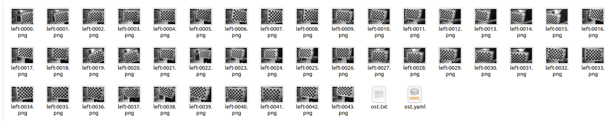

# calib toolkit box


## env 
```
open3d
opencv-python
prettytable
colorama

```


## params list
```
-s --src_path : the calib camera data root dir
-o --output_path : the calib camera data root dir
-b --chessboard : the chessboard size : (rows,cols),default=(11, 8)
-l --square_length : the chessboard square size (mm), default=20
-n --cam_num : the number of needed to calib
-t --thread_num : the multithred pool size, default=5
-v --verbose : Enable verbose output
--with_refine : with 3d pts refine processing
--undistort : undistort the rgb and depth
--operation : uthe calib operation: (0: calib), (1: error inference), (2: pcd vis) (3: raw pcd vis) (4:calib fish eye camera intr.), (5: vis undistorted result.)
--frame_id : the pcd vis frame id,default=0
--cam_ids : vis which camera pcd, defalut = [all cameras.]
--vis_pcd : vis raw depth camera pcds,default=[]
--intr_cams : need to calib fish eye intr cameras
--undist_cams : need to vis the undistort cameras results
--depth_trunc ： the threshold of trunc of depth for generating pcd,default=10.
```


## pipeline

**Capture the  raw data to calib the fish eye intr and dist parameters like following example**


0. calib fish eye camera intr

```
python demo.py -s path/to/data --operation 4 -n 16 --intr_cams Cam12 Cam13 Cam14 Cam15 
```

**check intr and dist for fish eye camera**
```
python demo.py -s path/to/data --operation 5 -n 16 --undist_cams Cam12 Cam13 Cam14 Cam15 
```

1. calib camera

```
python demo.py -s path/to/data --operation 0 -n 16 
```

2. vis cpd
```
python demo.py -s path/to/data --operation 2 -n 16 --frame_id 10
```

3. compute error.
```
python demo.py -s path/to/data --operation 1 -n 16 
```

4. raw pcd generation.
```
python demo.py -s path/to/data --operation 3 -n 16 --vis_pcd Cam0 Cam1 Cam2 Cam10 --frame_id 0 --depth_trunc 10.0
```